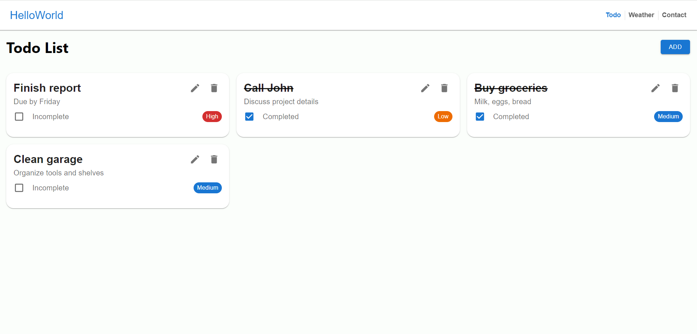
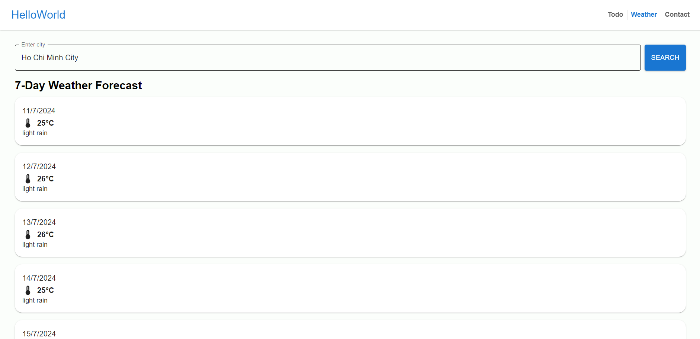
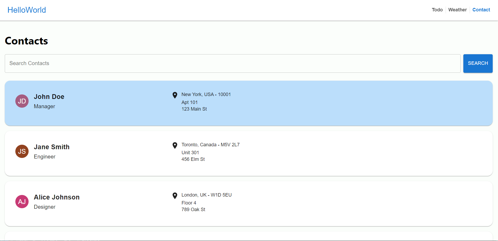

# HelloWorld Web App in React.js

This project is a HelloWorld web application built in React.js. It includes a to-do list feature, a weather forecast page that retrieves real-time weather data using an open-source weather API and a contact page to search for data from Appendix I.

## Screenshots

### Todo List



<br/>
<br/>

With **To-do List** users can add, edit, remove, and complete any items.

<br/>
<br/>

### Weather Forecast


With **Weather Forecast**, users can input a city/location and observe real-time weather forecast for the coming 7 days.

<br/>
<br />

### Contact List



With **Contact List**, users can search for contact information, which are extracted from .csv files (Appendix I).

<br/>
<br/>

## ✨ Getting Started

- Make sure you already have `Node.js` and `npm` installed in your system.
- You need an API key from [OpenWeatherMap](https://openweathermap.org/). After creating an account, [grab your key](https://home.openweathermap.org/api_keys).
- Then, in the `.env` file, replace `REACT_APP_WEATHER_API_KEY` with your OpenWeatherMap API Key.

<br/>

## ⚡ Install

- Clone the repository:

```bash
git clone https://github.com/hoabao0809/otto-assignment.git

```

- Install the packages using the command `npm install`

<br/>

## 📙 Used libraries

- `react-js`
- `material-ui`

Check `packages.json` for details

<br/>

<br/>
Thank You ☺
